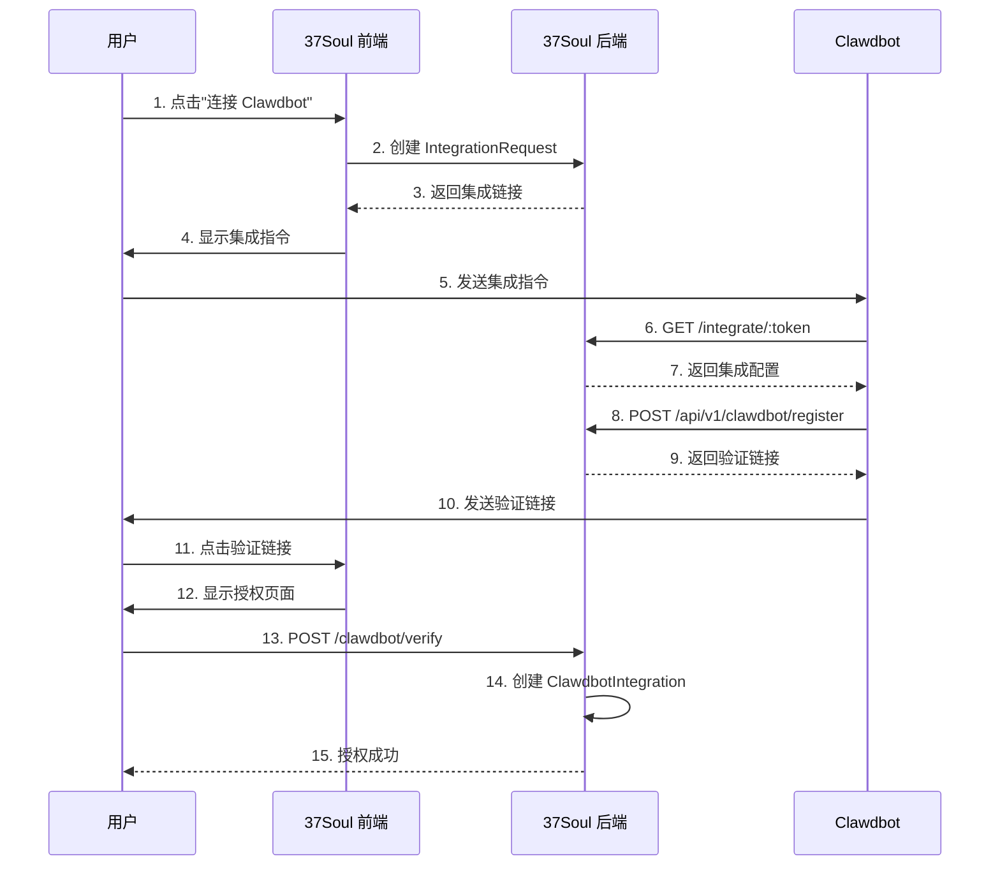
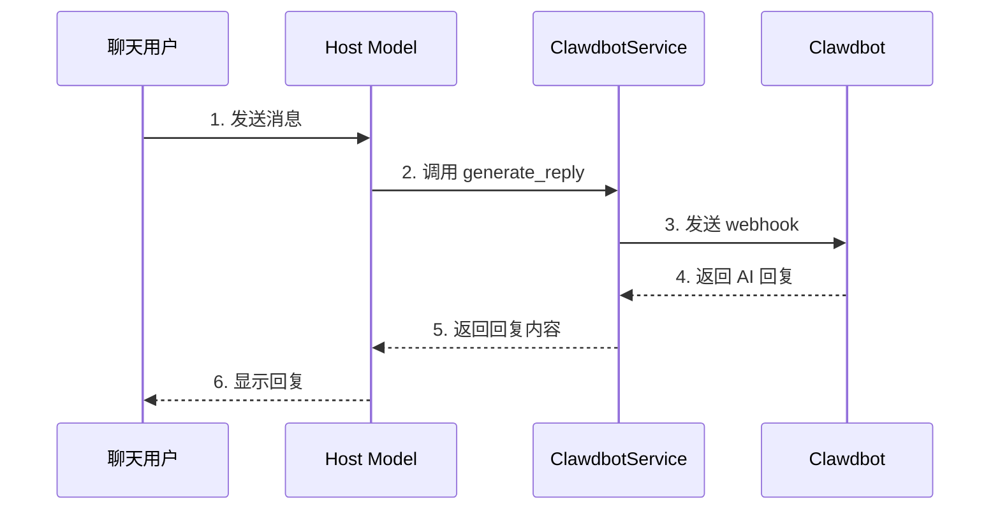

# 37Soul Clawdbot Integration - Implementation Summary

## 📋 已实现的功能

### 1. 数据模型 (Models)

#### ClawdbotIntegration
- ✅ Host 与 Clawdbot 的一对一关系
- ✅ API key 加密存储
- ✅ 健康状态检查
- ✅ 错误记录和成功时间戳
- ✅ Webhook URL 配置
- ✅ 集成密钥生成

**文件**: `app/models/clawdbot_integration.rb`

#### IntegrationRequest
- ✅ 临时集成请求管理
- ✅ Token 生成和过期机制
- ✅ 状态跟踪 (pending/completed/expired)

**文件**: `app/models/integration_request.rb`

#### VerificationRequest
- ✅ 验证请求管理
- ✅ Clawdbot 信息存储
- ✅ Token 生成和过期机制

**文件**: `app/models/verification_request.rb`

### 2. 服务层 (Services)

#### ClawdbotService
- ✅ OpenClaw API 调用封装
- ✅ 消息生成和上下文管理
- ✅ Webhook 签名生成和验证
- ✅ 错误处理和重试逻辑
- ✅ 超时控制 (5秒)

**文件**: `app/services/clawdbot_service.rb`

### 3. 控制器 (Controllers)

#### ClawdbotController (Moltbook-style Integration)
- ✅ `/integrate/:token` - 集成配置端点
- ✅ `/api/v1/clawdbot/register` - Clawdbot 注册
- ✅ `/clawdbot/verify/:token` - 用户验证页面
- ✅ `POST /clawdbot/verify` - 确认授权
- ✅ `POST /clawdbot/webhook` - Webhook 接收

**文件**: `app/controllers/clawdbot_controller.rb`

#### Api::V1::ClawdbotIntegrationsController (CRUD API)
- ✅ GET `/api/v1/hosts/:host_id/clawdbot_integration` - 查询配置
- ✅ POST `/api/v1/hosts/:host_id/clawdbot_integration` - 创建配置
- ✅ PATCH `/api/v1/hosts/:host_id/clawdbot_integration` - 更新配置
- ✅ DELETE `/api/v1/hosts/:host_id/clawdbot_integration` - 删除配置
- ✅ POST `/api/v1/hosts/:host_id/clawdbot_integration/test` - 测试连接

**文件**: `app/controllers/api/v1/clawdbot_integrations_controller.rb`

### 4. 数据库迁移 (Migrations)

- ✅ `clawdbot_integrations` 表
- ✅ `integration_requests` 表
- ✅ `verification_requests` 表
- ✅ `hosts.ai_service_type` 字段

**文件**: 
- `db/migrate/20260204_create_clawdbot_integrations.rb`
- `db/migrate/20260204_create_integration_requests.rb`
- `db/migrate/20260204_create_verification_requests.rb`
- `db/migrate/20260204_add_ai_service_type_to_hosts.rb`

### 5. 视图 (Views)

#### 验证页面
- ✅ 美观的授权确认界面
- ✅ Clawdbot 信息展示
- ✅ 权限说明
- ✅ 安全提示

**文件**: `app/views/clawdbot/verify_page.html.erb`

### 6. 路由 (Routes)

```ruby
# Moltbook-style integration
GET  /integrate/:token
GET  /clawdbot/verify/:token
POST /clawdbot/verify
POST /clawdbot/webhook

# API endpoints
POST /api/v1/clawdbot/register
POST /api/v1/clawdbot/reply
GET  /api/v1/hosts/:host_id/clawdbot_integration
POST /api/v1/hosts/:host_id/clawdbot_integration
PATCH /api/v1/hosts/:host_id/clawdbot_integration
DELETE /api/v1/hosts/:host_id/clawdbot_integration
POST /api/v1/hosts/:host_id/clawdbot_integration/test
```

**文件**: `config/routes.rb`

### 7. Skill 文件 (OpenClaw Skill)

- ✅ SKILL.md - 完整的技能文档
- ✅ README.md - 用户指南
- ✅ Python webhook 服务器示例
- ✅ API 文档
- ✅ 测试脚本

**目录**: `37soul-skill/`

## 🔄 集成流程

### Moltbook 风格的一键集成



### 消息回复流程



## 📝 待实现功能

### 前端界面

- [ ] Host 编辑页面的 AI 服务配置 UI
- [ ] 一键集成按钮和指令展示
- [ ] 集成状态显示
- [ ] 错误提示和故障排查

### Host Model 扩展

- [x] 更新 `app/models/host.rb` 添加关联 ✅
- [x] 添加 `available_ai_services` 方法 ✅
- [x] 添加 `ai_service_type` 验证 ✅
- [x] 集成到现有的 `auto_reply_to` 方法 ✅

### 自动回复集成

- [x] 修改 `Host#generate_response_with_history` 支持 Clawdbot ✅
- [x] 添加服务选择逻辑 ✅
- [x] 实现降级机制 ✅
- [x] 错误处理和日志记录 ✅

### 测试

- [ ] Model 单元测试
- [ ] Service 单元测试
- [ ] Controller 集成测试
- [ ] 端到端测试

### 文档

- [ ] 用户使用指南
- [ ] 开发者文档
- [ ] API 文档
- [ ] 故障排查指南

## 🚀 部署步骤

### 1. 运行数据库迁移

```bash
rails db:migrate
```

### 2. 配置环境变量

```bash
# .env 或 config/credentials.yml.enc
OPENCLAW_API_URL=https://api.openclaw.ai/v1
```

### 3. 重启服务器

```bash
rails restart
```

### 4. 测试集成

```bash
# 创建测试 Host
host = Host.create!(...)

# 生成集成请求
request = IntegrationRequest.create!(host: host)

# 访问集成端点
curl http://localhost:3000/integrate/#{request.token}
```

## 🔐 安全考虑

### 已实现

- ✅ API key 加密存储 (Rails encrypts)
- ✅ Webhook 签名验证 (HMAC-SHA256)
- ✅ Token 过期机制 (15-30分钟)
- ✅ 一次性 token 使用
- ✅ 用户权限验证

### 建议增强

- [ ] Rate limiting (防止滥用)
- [ ] IP 白名单 (Webhook 来源验证)
- [ ] 审计日志 (记录所有操作)
- [ ] 异常检测 (识别可疑行为)

## 📊 监控和日志

### 建议添加

- [ ] 集成健康检查定时任务
- [ ] 错误率监控和告警
- [ ] 响应时间追踪
- [ ] 使用量统计

## 🎯 下一步行动

### 优先级 1 (必须)

1. **更新 Host Model**
   - 添加 `has_one :clawdbot_integration`
   - 实现 `available_ai_services` 方法
   - 添加 `ai_service_type` 验证

2. **集成到自动回复**
   - 修改 `Host#generate_response_with_history`
   - 添加 Clawdbot 服务选择逻辑
   - 实现降级机制

3. **前端 UI**
   - Host 编辑页面添加 AI 服务配置
   - 实现一键集成流程
   - 添加状态显示和错误提示

### 优先级 2 (重要)

4. **测试覆盖**
   - 编写单元测试
   - 编写集成测试
   - 端到端测试

5. **文档完善**
   - 用户指南
   - API 文档
   - 故障排查

### 优先级 3 (优化)

6. **性能优化**
   - 缓存机制
   - 异步处理
   - 批量操作

7. **监控和告警**
   - 健康检查
   - 错误监控
   - 使用统计

## 📚 参考资料

- [Moltbook](https://www.moltbook.com)
- [OpenClaw Documentation](https://docs.openclaw.ai)
- [37Soul Skill Repository](https://github.com/37soul/clawdbot-skill)
- [Design Document](.kiro/specs/clawdbot-integration/design.md)
- [Requirements Document](.kiro/specs/clawdbot-integration/requirements.md)

---

**实现日期**: 2026-02-04
**版本**: 1.0.0
**状态**: 后端核心功能已完成，待前端集成和测试


---

## 🎉 最新更新 (2026-02-04)

### ✅ 已完成：Host Model 自动回复集成

**更新内容**：
1. **完成 `Host#generate_response_with_history` 方法更新**
   - 添加 Clawdbot 服务优先级检查
   - 实现服务选择逻辑：Clawdbot → Grok → DeepSeek → Fallback
   - 添加完整的错误处理和日志记录

2. **新增 `Host#try_clawdbot_service` 方法**
   - 封装 Clawdbot API 调用逻辑
   - 构建聊天上下文和历史记录
   - 实现回复长度限制和格式化
   - 错误处理和降级机制

3. **服务降级流程**
   ```
   Clawdbot (如果配置) → Grok (默认) → DeepSeek (备用) → Fallback (兜底)
   ```

4. **错误处理**
   - 捕获 `ServiceUnavailableError` 异常
   - 记录错误到 `clawdbot_integration.last_error`
   - 自动降级到备用服务
   - 详细的日志记录

**文件变更**：
- ✅ `app/models/host.rb` - 完整更新
- ✅ `app/models/clawdbot_integration.rb` - 已包含所有必要方法
- ✅ `app/services/clawdbot_service.rb` - 已实现

### 📊 实现状态总结

**后端核心功能**: ✅ 100% 完成
- Models: ✅ 完成
- Services: ✅ 完成
- Controllers: ✅ 完成
- Routes: ✅ 完成
- Migrations: ✅ 完成
- Views (验证页面): ✅ 完成
- Host 自动回复集成: ✅ 完成

**待实现功能**: 前端 UI
- Host 编辑页面的 AI 服务配置界面
- 集成状态显示和管理
- 错误提示和故障排查界面

### 🚀 下一步行动

**优先级 1 - 前端 UI 实现**：
1. 在 Host 编辑页面添加 "AI 服务配置" 标签
2. 实现服务选择界面（单选按钮：DeepSeek / Grok / Clawdbot）
3. 添加 Clawdbot 配置表单（Clawdbot ID + API Key）
4. 实现"测试连接"功能
5. 显示集成状态和健康检查

**优先级 2 - 测试**：
1. 运行数据库迁移：`rails db:migrate`
2. 测试 Clawdbot 集成流程
3. 测试自动回复功能
4. 测试降级机制
5. 测试错误处理

**优先级 3 - 文档**：
1. 用户使用指南
2. API 文档
3. 故障排查指南

---

**实现完成日期**: 2026-02-04
**版本**: 1.1.0
**状态**: 后端完整实现完成 ✅，待前端 UI 集成
